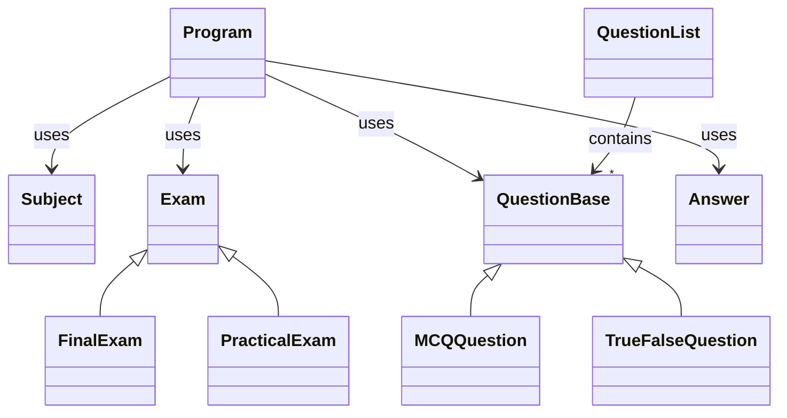

# ExaminationSystemConsoleApp

## 📚 Overview

The Examination System Console Application is a robust, flexible tool designed to create, manage, and conduct various types of examinations. Built with C#, this application showcases object-oriented programming principles and provides a user-friendly interface for exam creation and administration.

## 🌟 Features

- 📝 Support for multiple exam types (Practical and Final)
- 🔀 Various question formats (Multiple Choice and True/False)
- ⏱️ Customizable exam duration
- 🧮 Automatic scoring system
- 🎛️ Intuitive console-based user interface

## 🏗️ Architecture

The application is built using a modular architecture, promoting code reusability and maintainability:



 ## 🚀 Getting Started
 
 ## Prerequisites
- .NET 8.0 SDK or later
- Visual Studio 2024 or later (recommended)

## Installation

1. Clone the repository:
``` git clone https://github.com/your-username/ExaminationSystemConsoleApp.git ```

2. Open the solution in Visual Studio.
3. Build the solution to restore NuGet packages.

## Running the Application

1. Set the ``ExaminationSystemConsoleApp`` as the startup project.
2. Press F5 or click "Start Debugging" to run the application.
3. Follow the on-screen prompts to create and take exams.

## 💡 Usage

1- Create an Exam:
- Choose the exam type (Practical or Final)
- Set the exam duration
- Add questions (MCQ or True/False)


2- Take an Exam:
- Start the exam
- Answer the questions within the time limit
- View your score upon completion


## 🛠️ Extending the System
To add new question types or exam formats:

1- Create a new class inheriting from QuestionBase or Exam respectively.
2- Implement the required methods and properties.
3- Update the Program class to include the new types in the creation process.


## 📄 License
This project is licensed under the MIT License - see the LICENSE file for details.
